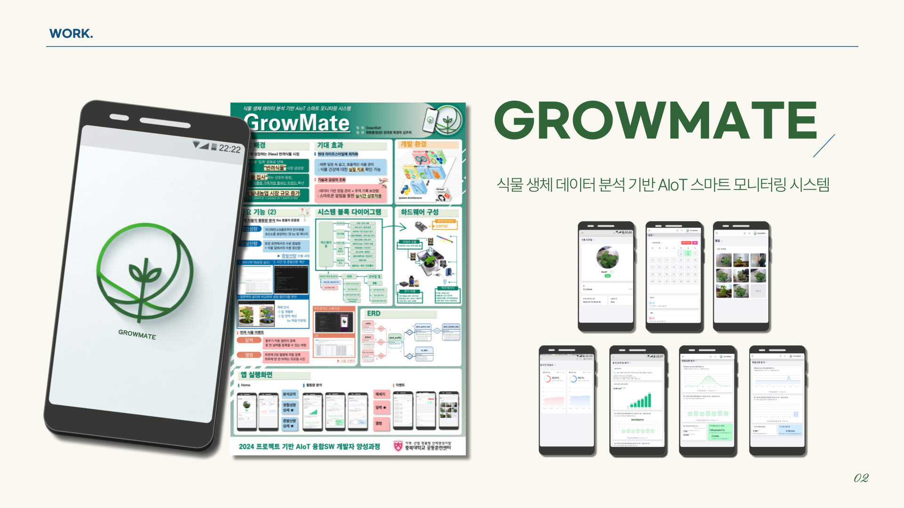
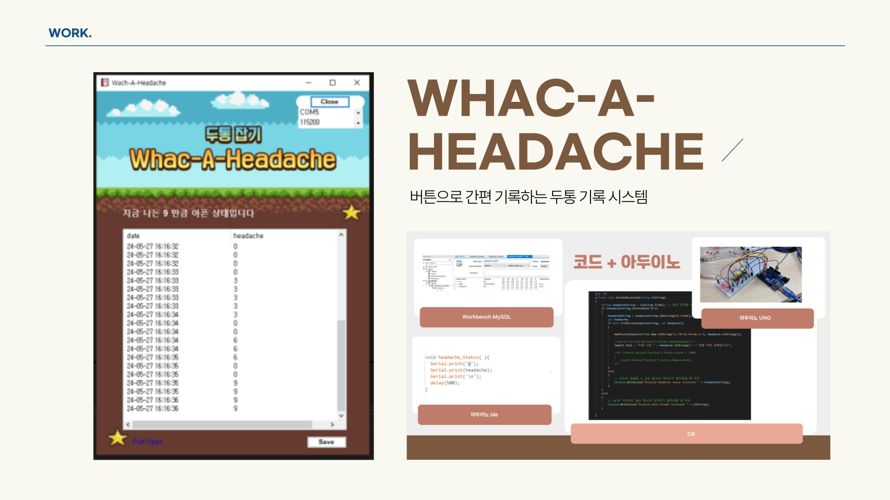
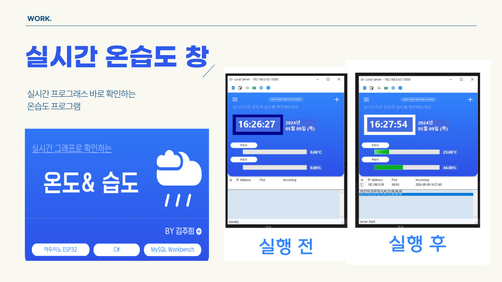
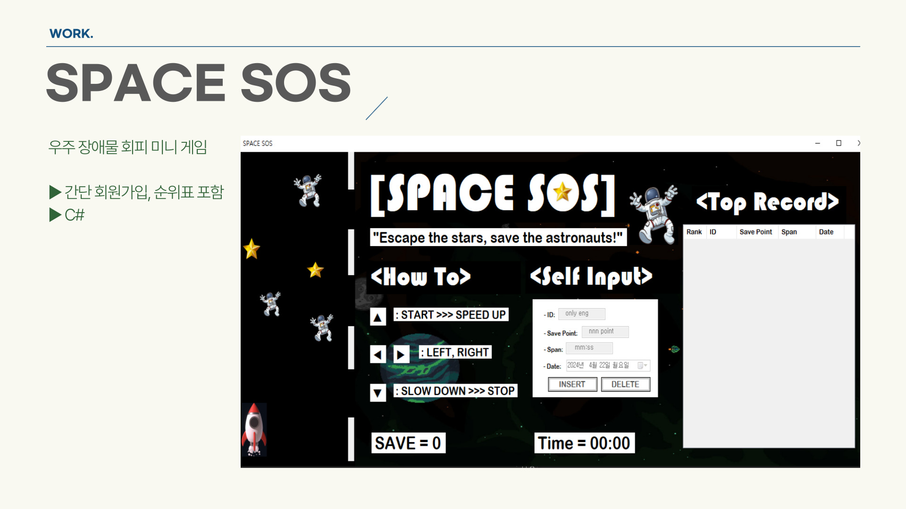
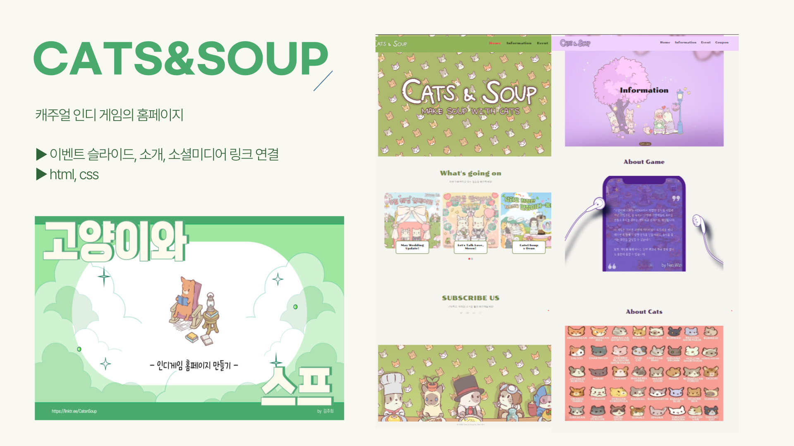

# 안녕하세요! 🏊‍♀️💻 프로그래밍 세계에서 열심히 헤엄치는 김주희입니다

## 🌊 About Me

멋쟁이사자처럼에서 프론트엔드 스쿨 12기를 수강 중입니다.
열심히 공부해서 실력 있는 개발자로 성장하고 싶습니다.

 

## 🏊‍♀️ Tech Stack

 

## 🧰 Tools

 

## 🏆 Certifications

- 🏄‍♀️ GTQ(포토샵) 1급
- 🌊 일러스트 2급
- 🚗 운전면허 1급
- 🗾 JLPT 3급

 

## 🐠 Portfolio

<table>
  <tr>
    <td></td>
    <td></td>
  </tr>
  <tr>
    <td></td>
    <td></td>
    <td></td>
  </tr>
</table>

 

## 📊 GitHub Stats

 

## 🏊‍♂️ Hobbies

_연락 안 되면 높은 확률로 수영 중!_ 🏊‍♀️💻
 
 
 

